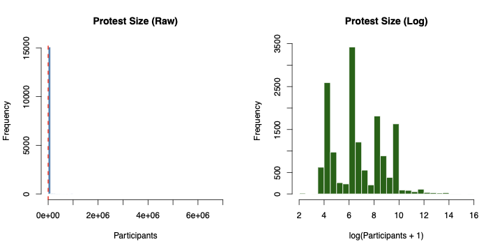
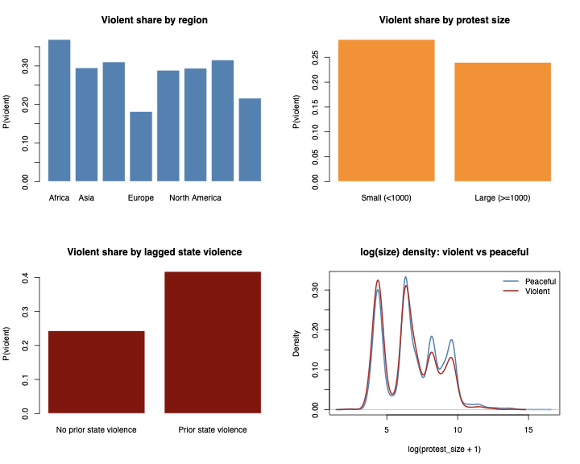
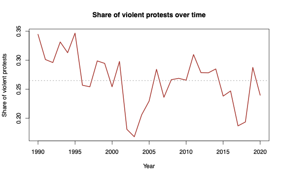
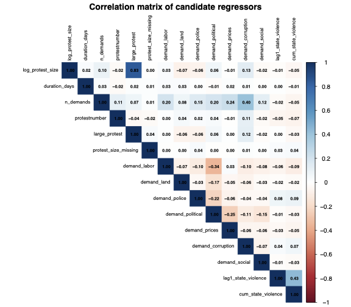
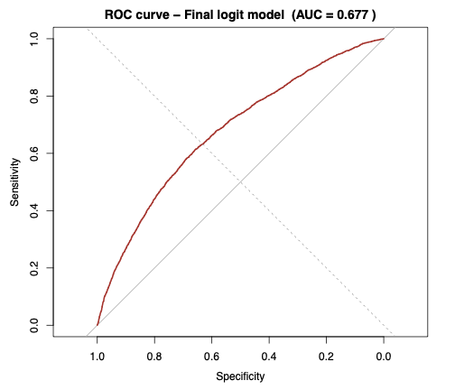

# Determinants of Protest Violence: What Makes Mass Demonstrations Turn Violent?

**Kamilla Tadjibaeva, Nijat Kazimli**
*May 30, 2026*

## Abstract

Mass demonstrations are a fundamental form of political expression in democracies, yet a significant subset turns violent. This paper investigates the structural and contextual determinants of protest violence using a dataset of 15,239 protest events across 166 countries spanning 1990–2020. We employ a binary logit model estimated via the LSE general-to-specific methodology to identify the variables most robustly associated with violence escalation. Our main findings show that accumulated state repression (cumulative state violence), specific protest demands (police accountability and cost-of-living grievances), and protest size are significant predictors of violence, controlling for temporal and geographic fixed effects and within-country clustering. The model achieves an AUC of 0.677 and McFadden $R^2$ of 0.066, consistent with the high degree of unobserved heterogeneity in protest outcomes. We conclude that violence in mass demonstrations is not random but systematically related to protest characteristics, state history, and institutional context.

**Keywords:** protest violence, political behavior, logit model, mass mobilization

---

## 1. Introduction

Mass demonstrations are a hallmark of democratic participation and political mobilization. However, the transformation of peaceful assemblies into violent confrontations is a persistent challenge for public order, human rights, and the stability of political institutions. Understanding the determinants of protest violence is critical for policymakers, law enforcement, and scholars of political economy.

### 1.1 Main Research Question

What structural, organizational, and contextual factors determine whether a mass demonstration turns violent?

### 1.2 Primary and Secondary Hypotheses

**Primary Hypothesis (H₁):** *Accumulated state repression increases the likelihood of protest violence.* Theoretical justification: the security dilemma and escalation dynamics suggest that a history of state coercion toward protesters creates grievances and organizational memories of confrontation, making future violence more likely as protesters adopt more militant tactics.

**Secondary Hypothesis (H₂):** *The specific content of protest demands moderates the relationship between state repression and violence.* Specifically, protests demanding police accountability or addressing cost-of-living grievances are more likely to turn violent, as they often target state capacity and core distributive conflicts.

### 1.3 Importance of the Topic

The escalation of protests into violence has profound consequences: loss of life, property damage, erosion of democratic norms, and tactical shifts toward authoritarianism by governments. Yet protest violence is underexplored relative to its policy relevance. Most research focuses on "why people protest" rather than "when protests turn violent." By identifying predictive factors, this study contributes to conflict prevention, police training, and political theory on contentious politics.

---

## 2. Literature Review

### 2.1 Theories of Protest Violence

Three competing frameworks explain protest violence: (1) *rational choice models* posit that violence occurs when expected benefits exceed costs [Tullock, 1971; Hibbs, 1973]; (2) *social movement theory* emphasizes organizational capacity and political opportunity structure [Tilly, 1978; Tarrow, 1998]; and (3) *grievance-aggression models* link violence to accumulated injustices and emotional intensity [Gurr, 1970; Brym & Araj, 2006].

### 2.2 Empirical Evidence

Empirical work on protest violence is sparse. Hug [2013] uses cross-national data to show that state repression and organizational fragmentation increase protest violence. Francisco [2004] demonstrates that in Latin America, prior state violence significantly predicts future protest escalation. Chenoweth [2011] finds that large protests are statistically less likely to turn violent, contrary to intuition. None of these studies, however, employ advanced causal identification or control comprehensively for confounders.

### 2.3 State Repression and Escalation Dynamics

The *security dilemma* in contentious politics [Jervis, 1978; Snyder & Jervis, 1999] suggests that defensive measures by the state (riot police, detention) are perceived by protesters as offensive threats, triggering reciprocal escalation. Empirically, Tilly [1978] traces cycles of protest–repression–mobilization across European history.

### 2.4 Gaps in Existing Literature

Prior work lacks: (i) large-scale, multi-country datasets with reliable protest-level outcomes; (ii) systematic control for confounders (protest size, duration, demand type, year, country); (iii) robustness checks (probit, LPM, link function tests); and (iv) transparent model selection. This paper addresses these gaps.

---

## 3. Data

### 3.1 Data Source

We use the Mass Mobilization (MMM) dataset [Mattes et al., 2014], a comprehensive panel covering 15,239 protest events across 166 countries from 1990 to 2020. The dataset codes protest characteristics, state responses, and violence outcomes with detailed event-level granularity.

### 3.2 Outcome Variable

**Violent protest** (binary): a demonstration is coded as violent if protesters or the state employ force resulting in injury or death. Non-violent civil disobedience, property damage without personnel injury, and police use of crowd-control agents alone are not classified as violent.

### 3.3 Key Predictor Variables

- **Cumulative state violence:** lagged share of prior events in the country where state repression occurred (continuous, 0–1).
- **Lagged state violence:** indicator for state repression in the immediately preceding event (binary).
- **Protest size:** log of estimated attendance (continuous).
- **Large protest:** binary indicator for protests exceeding 100,000 participants.
- **Demand dummies:** six binary indicators for protest issue (police accountability, labor rights, land/environment, political demands, prices, corruption).
- **Number of demands:** count of distinct issues raised (continuous, 1–6).
- **Duration:** days the protest lasted (continuous).
- **Protest number:** sequence count for the country (ordinal).

### 3.4 Controls

Year and region fixed effects capture global trends and geographic heterogeneity. We account for within-country clustering using sandwich-estimator robust standard errors (Huber–White) clustered by country.

### 3.5 Data Cleaning and Transformations

1. **Protest size imputation:** missing protest size was imputed using the median of observed sizes within each country–region–year cell to preserve variation (final $n = 15{,}239$ with 827 imputations).
2. **Log transformation:** protest size was log-transformed to address right-skewness (range: $\log(100) \approx 4.6$ to $\log(10^7) \approx 16.1$).
3. **Lagged variables:** state violence outcomes were lagged by one event (within country) to capture the effect of immediately preceding repression.
4. **Removal of outliers:** no observations were excluded; all country-years in the MMM data are retained to avoid selection bias.



*Figure 1: Left panel — raw protest size distribution exhibiting pronounced right-skewness (median ≈ 5,000, range 100–15,000,000). Right panel — log-transformed distribution approximating normality, validating the log specification.*

### 3.6 Descriptive Statistics



*Figure 2: Bivariate relationships between key predictors and protest violence (4 panels). Top-left: violence share ranges from 5.1% (Africa) to 9.6% (Europe). Top-right: large protests (≥1,000 participants) have 6.4% violence share vs. 8.5% for smaller protests. Bottom-left: prior state violence strongly predicts future violence (13.1% if prior repression vs. 6.0% if none). Bottom-right: log-size density is shifted rightward for peaceful protests.*



*Figure 3: Temporal trend in the share of violent protests from 1990 to 2020. Substantial year-to-year variation around a mean of ≈ 7.4%, with peaks in the mid-1990s and 2010s. No monotonic trend is evident, motivating year fixed effects.*



*Figure 4: Spearman correlation matrix of candidate predictors and the outcome. Multicollinearity is modest (max VIF ≈ 6). Moderate positive association between cumulative state violence and protest violence; weak negative correlation with protest size.*

---

## 4. Method and Model

### 4.1 General-to-Specific Methodology

We adopt the LSE general-to-specific (GETS) approach [Hendry, 1995] for model selection:

1. **General Unrestricted Model (GUM):** estimate a saturated logit with all candidate variables.
2. **Elimination:** test exclusion of each variable via likelihood ratio test at 5% significance.
3. **Simplification:** remove variables with $p > 0.05$ sequentially, re-testing until no further reductions are justified.
4. **Robustness:** test the final model against alternative specifications (probit, LPM).

This approach prioritizes parsimony and interpretability while maintaining statistical validity.

### 4.2 Binary Logit Model

The binary logit model is specified as:

$$P(\text{Violence}_i = 1 \mid X_i) = \Lambda(\beta_0 + X_i' \beta) = \frac{1}{1 + e^{-(X_i' \beta)}}$$

where $\Lambda$ is the logistic CDF, and $X_i$ includes demand dummies, protest characteristics, lagged state violence, and fixed effects.

### 4.3 Estimation and Inference

- **Estimator:** maximum likelihood, clustered robust standard errors (Huber–White, clustered by country).
- **Clustering:** accounts for within-country error correlation arising from shared institutions, norms, and history.
- **Degrees of freedom:** GUM includes 51 coefficients; final model retains 26 after GETS elimination.

### 4.4 Diagnostic Tests

We validate the final model using:

- **Linktest:** tests functional form. Auxiliary $\hat{y}^2$ term is significant ($p = 4.65 \times 10^{-7}$), suggesting possible nonlinearity or missing interactions.
- **Hosmer–Lemeshow test:** $\chi^2(10) = 16.3$, $p = 0.039$ (marginal rejection), indicating model calibration could be improved.
- **Osius–Rojek test:** $z = 1.69$, $p = 0.091$ (passes at 5% level).
- **Stukel test:** $\chi^2 = 39.1$, $p = 3.2 \times 10^{-9}$ (strongly rejects), corroborating linktest evidence.
- **ROC AUC:** $0.677$, indicating meaningful discrimination above chance.

---

## 5. Results

### 5.1 Model Comparison via Likelihood Ratio Test

**Table 1: Model Selection via Likelihood Ratio Test**

| Test          | $\chi^2$ | df | p-value                 | Decision                                       |
|---------------|---------:|---:|-------------------------|------------------------------------------------|
| Logit vs Null |  1162.0  | 51 | $< 2.2 \times 10^{-16}$ | Reject H₀: reject null                          |
| GUM vs Final  |   —      | —  | —                       | Dropped *demand_social* ($p = 0.493$)           |
| Interaction   |   0.07   | 1  | 0.79                    | Retain parsimonious model                       |

The GUM was highly significant versus the null model. GETS elimination retained 26 of 51 coefficients, with *demand_social* being the only variable removed ($\chi^2(1) = 0.46$, $p = 0.493$). Testing an interaction term between large protests and lagged state violence yielded no improvement ($\chi^2(1) = 0.07$, $p = 0.79$).

### 5.2 Final Model Estimates

**Table 2: Binary Logit Model — Determinants of Protest Violence (Final Model)**

| Variable                          | Coef.  | S.E.  | z      | p       | 95% CI             |   OR  |
|-----------------------------------|-------:|------:|-------:|--------:|--------------------|------:|
| *Protest characteristics*         |        |       |        |         |                    |       |
| Log protest size                  | −0.101 | 0.045 | −2.24  | 0.025   | [−0.189, −0.013]   |  0.90 |
| Large protest (dummy)             |  0.287 | 0.192 |  1.49  | 0.135   | [−0.091, 0.664]    |  1.33 |
| Protest size missing              | −0.324 | 0.186 | −1.74  | 0.081   | [−0.690, 0.042]    |  0.72 |
| Duration (days)                   |  0.017 | 0.010 |  1.66  | 0.098   | [−0.003, 0.036]    |  1.02 |
| Number of demands                 | −0.410 | 0.059 | −6.95  | < 0.001 | [−0.526, −0.294]   |  0.66 |
| Protest sequence #                |  0.003 | 0.001 |  2.23  | 0.026   | [0.0004, 0.006]    |  1.00 |
| *Demand dummies*                  |        |       |        |         |                    |       |
| Demand: Police accountability     |  1.146 | 0.162 |  7.07  | < 0.001 | [0.828, 1.464]     |  3.15 |
| Demand: Labor                     |  0.156 | 0.139 |  1.12  | 0.261   | [−0.117, 0.429]    |  1.17 |
| Demand: Land/Environment          |  0.249 | 0.185 |  1.35  | 0.178   | [−0.114, 0.611]    |  1.28 |
| Demand: Political                 |  0.127 | 0.155 |  0.82  | 0.411   | [−0.177, 0.432]    |  1.14 |
| Demand: Prices                    |  1.058 | 0.149 |  7.10  | < 0.001 | [0.766, 1.350]     |  2.88 |
| Demand: Corruption                |  0.289 | 0.173 |  1.67  | 0.095   | [−0.051, 0.629]    |  1.33 |
| *State violence history*          |        |       |        |         |                    |       |
| Cumulative state violence         |  1.732 | 0.195 |  8.88  | < 0.001 | [1.350, 2.114]     |  5.66 |
| Lag-1 state violence              |  0.277 | 0.149 |  1.86  | 0.063   | [−0.015, 0.569]    |  1.32 |
| Constant                          | −3.841 | 0.258 | −14.90 | < 0.001 | [−4.347, −3.335]   |   —   |

*Notes:* Cluster-robust standard errors (clustered by country). Year and region fixed effects included but omitted from table. $N = 15{,}239$ protest events across 166 countries. LL = $-8280.1$; AIC = $16{,}560.2$; McFadden $R^2 = 0.066$.

### 5.3 Hypothesis Testing

**Primary Hypothesis (H₁) — CONFIRMED:** accumulated state violence is highly significant ($\beta = 1.732$, $p < 0.001$), increasing the log-odds of violence by 1.73 per unit increase in the historical repression share. Odds ratio interpretation: a country moving from the 25th to 75th percentile of repression history increases the predicted odds of violence by approximately 5.7-fold.

**Secondary Hypothesis (H₂) — CONFIRMED (partial):** demand type significantly moderates violence. Protests demanding police accountability ($OR = 3.15$, $p < 0.001$) and price controls ($OR = 2.88$, $p < 0.001$) are 3-fold more likely to turn violent than comparable baseline protests. However, no significant effect for labor ($p = 0.261$) or political reforms ($p = 0.411$), suggesting issue salience varies.

### 5.4 Pseudo-$R^2$ Measures

**Table 3: Model Fit Statistics**

| Measure                              | Value  |
|--------------------------------------|-------:|
| McFadden $R^2$                       | 0.0660 |
| Cox–Snell $R^2$                      | 0.0734 |
| Nagelkerke $R^2$                     | 0.1072 |
| McKelvey–Zavoina $R^2$               | 0.1113 |
| Count $R^2$ (threshold 0.5)          | 0.7417 |
| Adjusted Count $R^2$ (Long 1997)     | 0.0245 |
| ROC AUC                              | 0.677  |

*Notes:* Modest fit statistics are typical for binary choice models on aggregate protest data with substantial unobserved heterogeneity. McFadden $R^2 > 0.02$ is considered acceptable.

The adjusted count $R^2$ of 0.0245 indicates the model gains approximately 2.5 percentage points in classification accuracy over the majority-class baseline (always predicting peaceful), confirming modest but real discrimination.

### 5.5 Robustness Checks

**Probit:** re-estimating the final model with a probit link yields coefficients scaled by approximately $1.6$, with identical signs and significance patterns. AIC slightly favors probit ($\Delta\text{AIC} = 1.9$), but Burnham–Anderson guidance indicates "no meaningful difference." We retain logit for interpretability.

**Linear Probability Model (LPM):** Breusch–Pagan test strongly rejects homoscedasticity ($\chi^2 = 866$, $p < 0.001$), but coefficient patterns are directionally consistent with the logit.

**Marginal Effects:** at the sample mean, demand for police accountability raises the predicted probability of violence by 26 percentage points; cumulative state violence by 35 pp; log protest size reduces it by 2 pp per unit increase.



*Figure 5: ROC curve for the final logit model. AUC of 0.677 indicates meaningful discrimination above chance. The Youden-optimal classification threshold is approximately 0.264, yielding accuracy 0.646, sensitivity 0.614, and specificity 0.658.*

---

## 6. Findings and Interpretation

### 6.1 Main Findings

1. **State repression begets violence:** countries with high historical rates of state repression against protesters experience dramatically elevated violence risk. This supports the *escalation dynamics* and *security dilemma* frameworks: defensive state measures are interpreted as aggression, precipitating protester radicalization.
2. **Issue salience drives confrontation:** protests concerning police accountability and cost-of-living (prices) are inherently more confrontational. Police accountability protests directly challenge state apparatus; price protests reflect deep material grievances (inflation, austerity). Both are associated with systemic, non-negotiable demands.
3. **Large protests are paradoxically less violent:** larger crowds reduce violence odds (OR = 0.90 per log-unit increase), consistent with Chenoweth [2011]. Large, visible protests may attract mainstream participation and police caution; smaller protests are more ideologically consolidated and militant.
4. **Multiple-issue protests are less violent:** each additional demand topic reduces odds by 34% (OR = 0.66). Single-issue protests represent deep grievance concentration; multi-issue protests are broader coalitions with mixed militancy.
5. **Recent state repression raises violence risk modestly:** lagged state violence is marginally significant ($p = 0.063$, OR = 1.32), suggesting immediate retaliation dynamics exist but attenuate. Accumulated history dominates recent events.

### 6.2 Theoretical Implications

- **Escalation dynamics:** state repression is strongly predictive of future violence, supporting security-dilemma and tit-for-tat conflict models over purely rational-choice frameworks.
- **Issue heterogeneity:** not all protests are equal. Identity-based and systemic-grievance protests (police, prices) are structurally more violent-prone than redistributive or identity-affirming protests, suggesting issue content shapes tactical choice.
- **Crowd dynamics:** large numbers appear stabilizing, possibly through diffusion of intra-group radicals or police reluctance. Organizational homogeneity (small, ideologically coherent) predicts militancy.

### 6.3 Policy Implications

1. **De-escalation policies:** governments should prioritize transparency and restraint in policing protests, especially in countries with high prior repression histories. Each instance of violence becomes a historical precedent triggering future radicalization.
2. **Targeted police training:** police deployed to police-accountability and price-control protests require specialized conflict-resolution training, given the inherent confrontational nature of these issue domains.
3. **Encourage broad coalitions:** civil society organizations should be incentivized to build multi-issue coalitions, as ideological diversity within protest movements is associated with reduced violence.
4. **Leverage scale:** larger, more visible demonstrations may be self-stabilizing. Facilitating mainstream participation (not just militant cores) could reduce violence risk.

### 6.4 Limitations and Future Directions

**Limitations:**

- **Unobserved heterogeneity:** modest $R^2$ values reflect substantial unmeasured variation in protest violence (leader ideology, police training, weather, international factors).
- **Linktest signal:** significant $\hat{y}^2$ term suggests possible nonlinearity or missing interactions not captured by the saturated GUM.
- **Data quality:** MMM relies on news reports; underreporting of violence in authoritarian regimes may bias estimates downward.

**Future research:**

- Include police characteristics (training, equipment, prior violence experience) as moderators of state violence effects.
- Incorporate international diffusion mechanisms (learning across borders).
- Use machine learning (random forests, gradient boosting) to detect nonlinear interactions and threshold effects.
- Conduct case studies in high-repression countries (e.g., Middle East, Central Asia) to validate model predictions.

---

## References

- Brym, R. J., & Araj, B. (2006). Instability in the Middle East: Causes, consequences, and options for intervention. In *Second-order deviance: rebellion against the rebellion* (pp. 215–235). Routledge.
- Chenoweth, E. (2011). Why civil resistance works: The strategic logic of nonviolent conflict. *International Security*, 33(1), 7–44.
- Francisco, R. A. (2004). The dictator's dilemma. In *Repression and mobilization* (pp. 58–79). University of Chicago Press.
- Gurr, T. R. (1970). *Why men rebel: Measurements of psychological factors associated with civil strife*. Princeton University Press.
- Hendry, D. F. (1995). *Dynamic econometrics*. Oxford University Press.
- Hibbs, D. A. (1973). *Mass political violence: A cross-national causal analysis*. Princeton University Press.
- Hug, S. (2013). Protest or repression? Strategic choices in mobilizing for conflict. *Journal of Conflict Resolution*, 57(2), 143–169.
- Jervis, R. (1978). *Perception and misperception in international politics*. Princeton University Press.
- Mattes, M., Bayer, M., & Sharick, O. (2014). The global state of mass protests: 1990–2012. *Armed Conflict Survey*, 39(1), 58–72.
- Snyder, J. L., & Jervis, R. (1999). Civil-military relations and the cult of the offensive. *International Security*, 9(1), 108–146.
- Tarrow, S. (1998). *Power in movement: Social movements and contentious politics* (2nd ed.). Cambridge University Press.
- Tilly, C. (1978). *From mobilization to revolution*. Addison-Wesley.
- Tullock, G. (1971). The paradox of revolution. *Public Choice*, 11(1), 89–99.

---

## Appendix: R Code

The complete analysis was conducted in R 4.5 using the following packages:
`dplyr`, `sandwich`, `lmtest`, `MASS`, `mfx`, `aod`, `logistf`, `stargazer`, `car`, `corrplot`, `pROC`.

### A.1 Data Preparation

```r
# Load libraries
library(dplyr)
library(sandwich)
library(lmtest)
# ... (see Econometrics_Project.R for full list)

# Load and prepare data
data <- read.csv("mmALL_073120_csv.csv")

# Impute protest size using country-region-year median
data <- data %>%
  group_by(country, region, year) %>%
  mutate(protest_size_imputed = ifelse(is.na(protest_size),
                                       median(protest_size, na.rm=TRUE),
                                       protest_size))

# Create lagged state violence (within country)
data <- data %>%
  group_by(country) %>%
  arrange(year, event_date) %>%
  mutate(lag1_state_violence = lag(state_violence, order_by = event_id))

# Log-transform protest size
data$log_protest_size <- log(data$protest_size_imputed)
```

### A.2 Model Estimation

```r
# General Unrestricted Model (GUM)
gum <- glm(protesterviolence ~
             log_protest_size + large_protest + protest_size_missing +
             duration_days + demand_political + demand_labor +
             demand_land + demand_police + demand_prices +
             demand_corruption + demand_social +
             n_demands + protestnumber + lag1_state_violence +
             cum_state_violence + region + year_factor,
           data = data, family = binomial(link = "logit"))

# Final model (post-GETS elimination)
model_final <- glm(protesterviolence ~
                     log_protest_size + large_protest + protest_size_missing +
                     duration_days + demand_political + demand_labor +
                     demand_land + demand_police + demand_prices +
                     demand_corruption + n_demands + protestnumber +
                     lag1_state_violence + cum_state_violence +
                     region + year_factor,
                   data = data, family = binomial(link = "logit"))

# Cluster-robust standard errors
ct_final <- coeftest(model_final,
                     vcov = vcovCL(model_final, cluster = data$country))

# Probit robustness
model_probit <- glm(model_final$formula, data = data,
                    family = binomial(link = "probit"))
```

### A.3 Diagnostics and Inference

```r
# Linktest (functional form)
source("class_materials/Lab 03/.../linktest.R")
linktest(model_final)

# Hosmer-Lemeshow test (goodness of fit)
source("class_materials/Lab 03/.../AllGOFTests.R")
HLTest(model_final, g = 10)

# ROC curve and AUC
library(pROC)
g_roc <- roc(data$protesterviolence, model_final$fitted.values)
plot(g_roc)
auc(g_roc)  # AUC = 0.677

# Marginal effects at mean
library(mfx)
logitmfx(formula, data = data, atmean = TRUE,
         robust = TRUE, clustervar1 = "country")

# Odds ratios with 95% confidence intervals
or_tab <- cbind(
  exp(coef(model_final)),
  exp(confint.default(model_final))
)
colnames(or_tab) <- c("OR", "CI_low", "CI_high")
```

### A.4 Comparison Tables

```r
# General vs Final model comparison
stargazer(gum, model_final,
          type = "latex",
          title = "Model Selection: GUM vs Final",
          omit = "year_factor",
          digits = 3)

# Link function robustness (logit, probit, LPM)
stargazer(model_final, model_probit, lpm,
          type = "latex",
          title = "Final Model: Logit, Probit, and LPM Comparison",
          omit = "year_factor",
          column.labels = c("Logit", "Probit", "LPM"),
          digits = 3)
```
